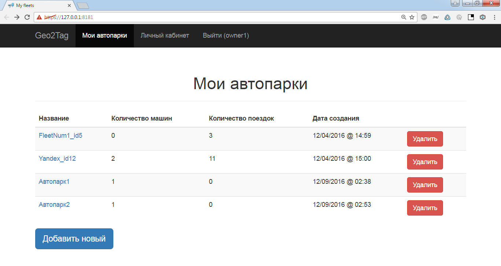
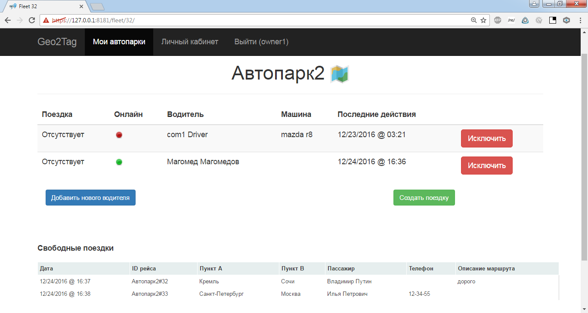
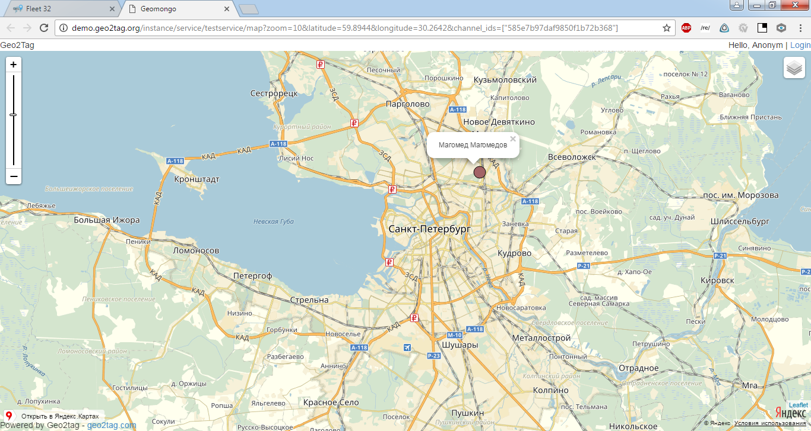
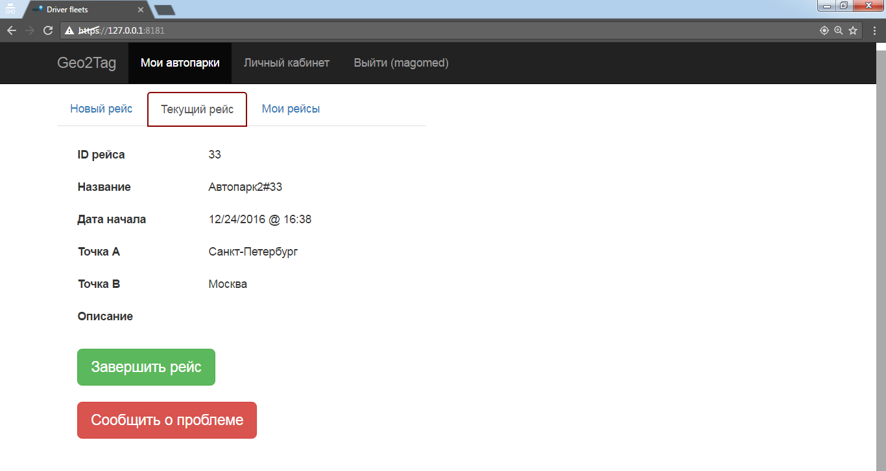
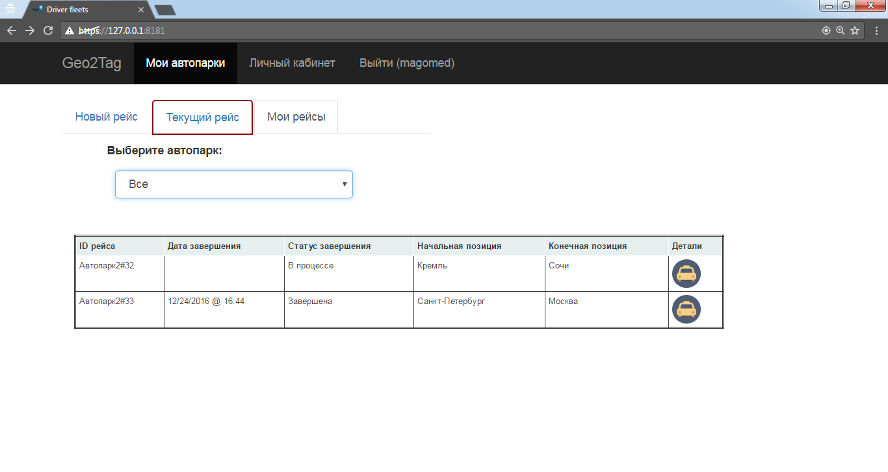

Задача
----
Разработка логистического сервиса, предназначенного для владельцев автопарков и таксистов.

Возможности использования приложения
------------------
В первую очередь, неоходимо произвести предварительную настройку
* Владелец создаёт в системе новый автопарк
* Владелец приглашает в созданный автопарк водителя
* Водитель принимает приглашение

Выполнение рейсов происходит следующим образом
* Владельцу автопарка поступает заявка, и он создаёт в системе новый рейс
* Рейс принимается одним из водителей, состоящих в автопарке
* В случае неожиданных обстоятельств, которые мешают выполнить рейс, водитель нажимает кнопку "Сообщить о проблеме".
* Водитель завершает рейс, и затем в любое время может посмотреть информацию о выполненных рейсам во вкладке "Мои рейсы"
* Владелец автопарка также может посмотреть информацию обо всех выполненных водителями рейсах

Отображение метоположения водителей на карте
* После принятия рейса водителем и до завершения, его местоположение через определённые промежутки времени передаётся на сервер
* Владелец автопарка может открыть карту, на которой отображается текущее местоположение всех водителей, состоящих в автопарке и выполняющих рейс

Скриншоты
--------------------------------------------------
####Страницы владельца




####Страницы водителя



Проект выполняется с помощью следующих технологий
--------------------------------------------------
Backend:<BR>
* Python 3.5
* Django v1.10
* [REST API](https://docs.google.com/document/d/1uh5APKgt6Ozbj0gjRRZadk0shikUIun0HMhPdDDxn0o/edit?usp=sharing)

Frontend:<BR>
* HTML5/СSS3
* Bootstrap3
* AngularJS 

Deployment
----------
1. Скачать архив проекта с гитхаба [(тык)](https://github.com/geo2tag-logistics/Geo2Logistics/archive/master.zip) (git clone https://github.com/geo2tag-logistics/Geo2Logistics)
2. Распаковать, перейти в директорию проекта из командной строки.
(Если Windows, то установить Python 3.5.2, либо другой питон 3 версии с менеджером пакетов pip3)
3. Для корректной передачи местоположения на сервер необходимо развёртывать приложение по проколу https. Запустить скрипт start_ssl.sh (Ubuntu) или start_ssl.bat (Windows).
4. Запустить по локальному адресу [https://127.0.0.1:8181/](https://127.0.0.1:8181/)
5. Для подключения с другой машины посмотреть ip адрес сервера через ipconfig (Windows) или ifconfig (Ubuntu). Открыть сайт с другой машины по адресу, например, https://192.168.1.35:8181. Если нет внешнего ip, то подключиться можно только с машины, находящейся в той же подсети (например, подключенной к той же wifi точке).
6. Так как сертификат самоподписанный, то браузер будет ругаться. Требуется добавить сертификат в виде исключения безопасности.

Страница логина.

    http://127.0.0.1:8000/

Django Admin tool.

    http://127.0.0.1:8000/admin/
 
Для создания учётной записи администратора необходимо ввести команду через manage.py
```
createsuperuser
```
